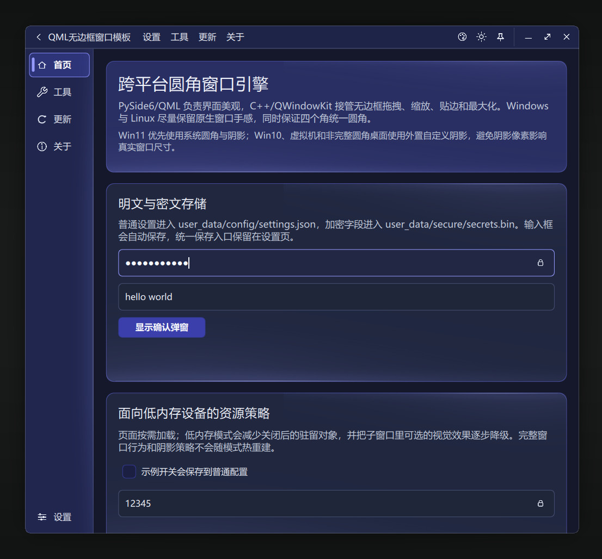
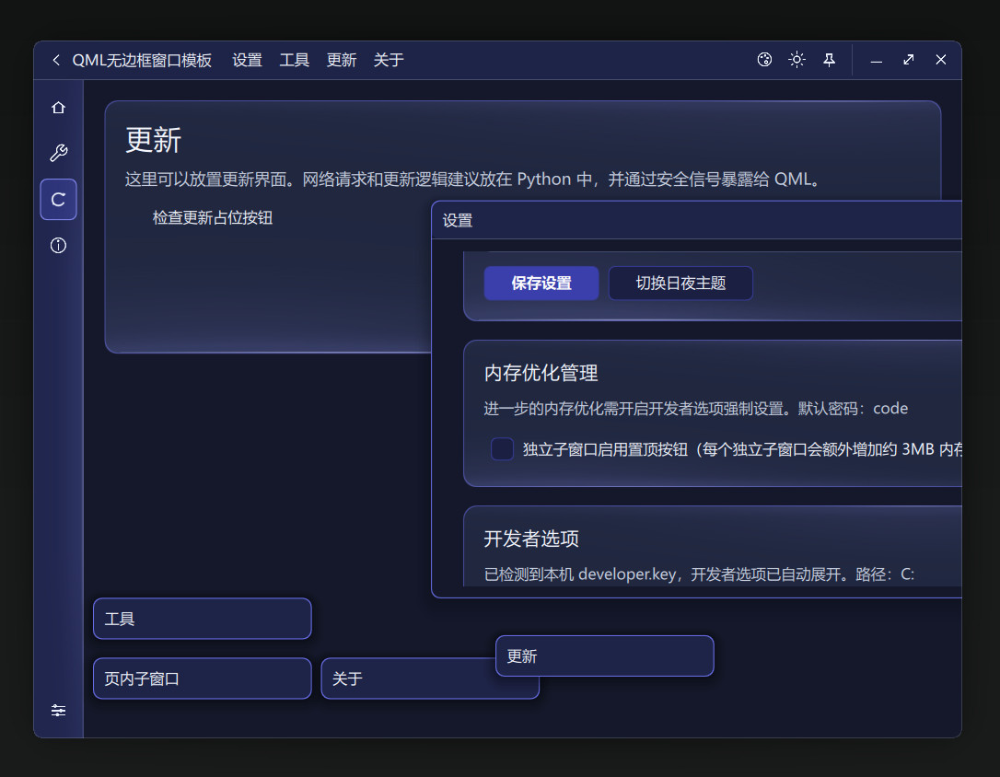
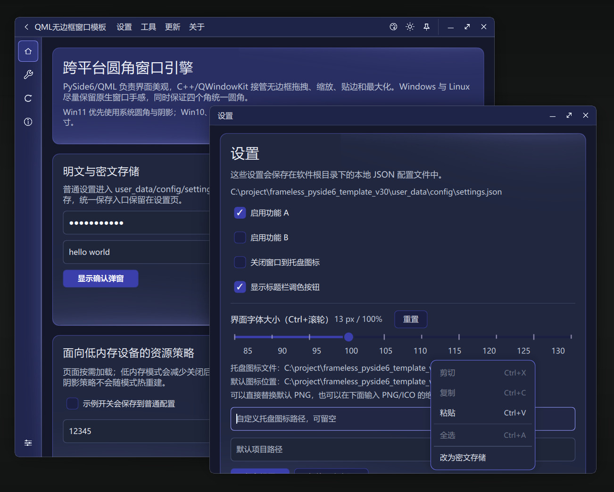
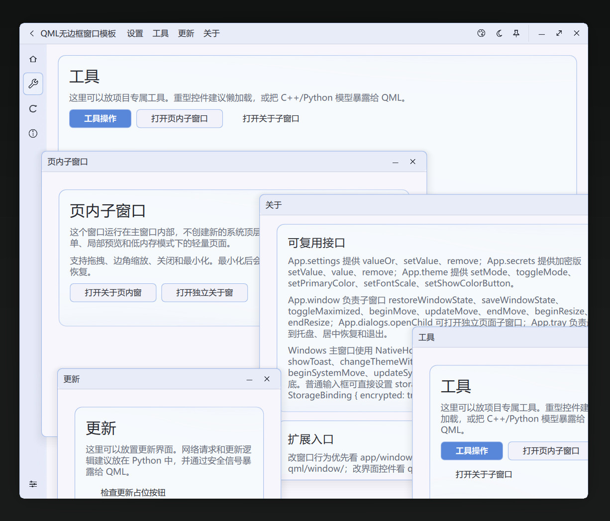
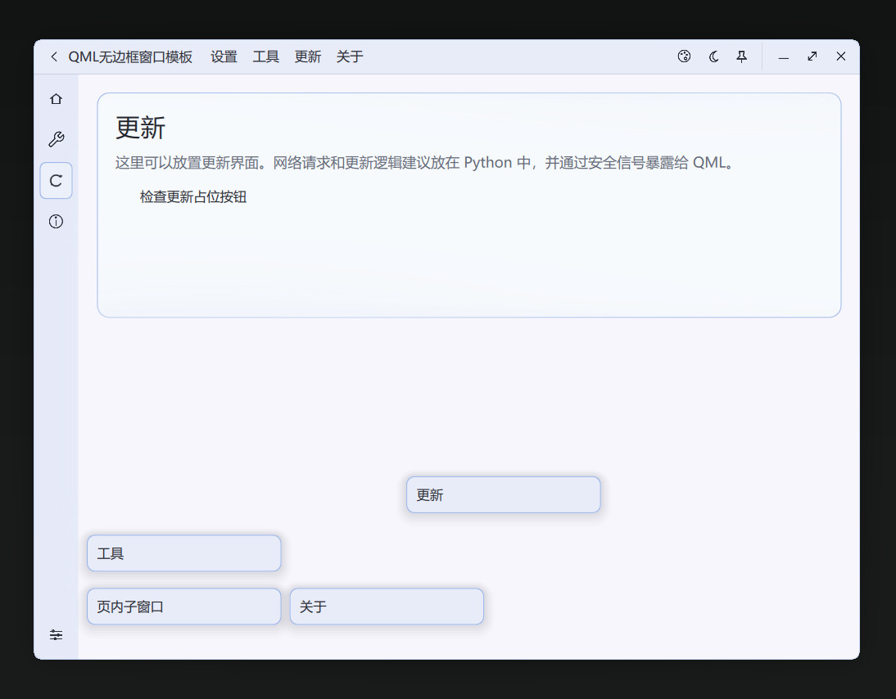

# QRoundedFrame

一个面向桌面软件的 PySide6 + QML 跨平台圆角窗口模板。

它不是只在 Windows 11 上看起来正常的演示项目，而是专门处理 Windows 10、虚拟机、Linux 桌面环境差异下的圆角、阴影和原生窗口行为。核心目标是：窗口四个角都保持统一圆角，拖拽、缩放、贴边、最大化和复原尽量接近系统原生体验，业务界面仍保留 QML 的现代观感。

## 界面预览

夜间样式：



夜间样式，页内子窗口：



夜间样式，更多控件：



| 日间样式 | 日间样式，更多控件 |
| --- | --- |
|  |  |

| 日间样式，页内子窗口 | 日间样式，页内子窗口最小化 |
| --- | --- |
|  |  |

## 主要特点

- **Windows + Linux 跨平台窗口壳**：主窗口、子窗口、标题栏、页面、托盘、设置、主题和弹窗按模块拆分，可作为桌面软件基础壳复用。
- **四角圆角策略**：Windows 11 正常环境优先使用系统圆角和系统阴影；Windows 10、虚拟机、Basic/Remote Display，以及 Linux 中没有完整四角圆角的环境，使用自定义圆角和外置阴影策略。
- **原生窗口行为优先**：拖拽、边缘缩放、左右半屏、上下贴边、最大化、复原和系统按钮命中区域尽量交给 native/QWindowKit 管理，减少 QML 几何补丁。
- **C++ 处理高频路径**：hit-test、native 注册、外置阴影 helper 窗口同步等高频窗口路径由 C++/QWindowKit 处理；Python 负责配置、托盘、存储和业务桥接；QML 负责界面表现。
- **低配电脑优化**：页面通过 Loader 按需加载，未访问分页不会提前创建；图标使用静态 PNG；关闭子窗口后尽量释放对象和缓存。

当前主窗口运行内存占用约 75MB（Linux上约68MB）；切换分页、打开组件、切换主题大约在 100MB 左右（Linux上约83MB），后续会自动释放回收到初始内存占用量。

## 运行方式

当前仓库自带 Windows x64 / Python 3.10 / PySide6 6.11 对应的 native 预编译模块。普通用户不需要安装 CMake 或 Visual Studio 即可运行。

```bash
pip install -r requirements.txt
python run.py
```

Windows 可以使用：

```bat
scripts\run_windows.bat
```

Linux 可以使用：

```bash
bash scripts/run_linux.sh
```

## 打包

Windows 打包：

```bash
python scripts/package_app.py
```

产物默认输出到：

```text
dist/QRoundedFrame/QRoundedFrame.exe
```

打包前脚本会检查 native 预编译模块是否匹配当前 Python / Qt / 平台。

## 窗口策略

| 环境 | 默认策略 |
| --- | --- |
| Windows 11 正常显示环境 | 系统圆角 + 系统阴影 |
| Windows 10 | 自定义圆角 + 外置 PNG 阴影 helper |
| Windows 11 虚拟机 / Basic Display / Remote Display | 自定义圆角 + 外置 PNG 阴影 helper |
| Linux X11 已验证桌面环境 | 可启用自定义窗口策略 |
| Linux Wayland 或未知桌面环境 | 保守回退系统标题栏，不用 Python 几何补丁硬修 compositor 限制 |

Linux 桌面环境差异较大，默认不假设所有 X11 桌面都安全。测试通过后，可把对应桌面环境加入白名单。

## 项目结构

```text
run.py                              程序入口
app/main.py                         PySide6 启动、native runtime 选择
app/window_policy.py                Windows/Linux 窗口策略判断
app/bridge/                         Python <-> QML 服务桥接
app/cpp/frameless_native/           C++ native 窗口模块源码
app/native/prebuilt/                已编译 FramelessNative Qt Quick 模块
qml/window/                         AppWindow、TitleBar、窗口壳和阴影 QML
qml/controls/                       通用控件
qml/layout/                         导航和页面容器
qml/pages/                          示例页面
resources/icons/                    静态图标
resources/images/                   阴影、色轮等运行资源
resources/examples/                 README 示例截图
references/                         视觉参考图，仅供界面改进时参考
scripts/                            运行、检查、编译和打包脚本
third_party/qwindowkit/             vendored QWindowKit 源码
```

`references/` 中的图片来自网络截图，只作为后续样式改进参考。

软件样式、窗口策略、主题美化等均为自行设计，因为在不断找美观和内存占用量的平衡点，所以美化方面没做太复杂。
如果对你有启发或者喜欢的话，点个 Star 吧~

## QWindowKit 来源

native 无边框行为基于 QWindowKit：

https://github.com/stdware/qwindowkit

本仓库暂时把 QWindowKit 源码放在 `third_party/qwindowkit/`，方便普通用户 clone 后直接编译，不需要额外初始化 submodule。当前版本包含针对本模板右侧、底部、角落 resize 命中区域的本地调整；后续升级 QWindowKit 时需要重新核对这些补丁。

## Native 预编译模块

仓库保留了运行必需的 Windows native 预编译模块：

```text
app/native/prebuilt/win32-x64-py310-qt6.11-system/qml/FramelessNative
app/native/prebuilt/win32-x64-py310-qt6.11-custom/qml/FramelessNative
```

- `system`：用于可信系统圆角/阴影路径，例如正常 Windows 11。
- `custom`：用于 Windows 10、虚拟机、Basic Display 等需要自定义圆角和外置阴影的路径。

如果 Python、PySide6/Qt 或系统架构不同，需要重新编译 native 模块。

## 重新编译 native 模块

Windows 下使用：

```bat
scripts/build_windows.bat
```

它会构建 `system` 和 `custom` 两套模块，并运行完整性检查。编译过程目录 `app/cpp/frameless_native/build-*` 不需要上传到仓库。

Linux 下使用：

```bash
bash scripts/build_linux.sh
```

生成的 QML 模块会放到 `app/native/prebuilt/` 对应平台目录。没有匹配预编译模块时，程序会回退到保守窗口路径；推荐为目标平台编译 native 模块，以获得更稳定的窗口行为。

## 常用接口

QML 中可通过全局 `App` 访问配置、密文存储、主题、子窗口和托盘服务：

```qml
App.settings.valueOr("layout/navWidth", 220)
App.settings.setValue("project/name", "demo")

App.secrets.setValue("account/token", token)
App.secrets.value("account/token")

App.theme.setMode("dark")
App.theme.setPrimaryColor("#537FCD")

App.dialogs.openChild(root.Window.window, "settings", ({}))
App.tray.centerMainWindow()
```

页面代码不需要关心当前机器是系统阴影路径还是自定义阴影路径，窗口策略由 Python 和 native 层统一处理。

## 发布说明

仓库不包含：

- `user_data/` 本地配置和密文数据
- `app/cpp/frameless_native/build-*` 编译过程目录
- 打包产物 `dist/` 和 PyInstaller 中间目录

仓库保留：

- Python/QML 源码
- C++ native 源码
- `third_party/qwindowkit` vendored 源码
- Windows 运行必需 native 预编译模块
- 资源文件和脚本

## Star

喜欢的话点个 Star 吧。
